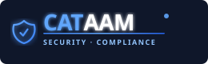

<p align="center">
  <a href="https://cataam.com">
    
  </a>
</p>

<p align="center">
  <a href="https://cataam.com"></a>
  <a href="LICENSE"></a>
  <a href="https://github.com/cataam-security/cataam/stargazers"></a>
  <a href="https://github.com/cataam-security/cataam/issues"></a>
</p>

<p align="center">
  <strong>Open-source security tooling and compliance knowledge — maintained by the <a href="https://cataam.com">Cataam</a> team.</strong>
</p>

---

**Cataam** is a commercial GRC, iASM & BAS platform for CISOs, CPAs, and enterprises. This repository is the open-source initiative that comes with it — practical scripts, CVE detection tools, hardening guides, and compliance templates shared freely with the security community.

Everything here is MIT-licensed and production-ready. Use it standalone, integrate it into your own tooling, or contribute back.

---

## What's in This Repository

| Folder | Purpose | Who It Helps |
|--------|---------|--------------|
| [`/tools`](./tools/) | Hardening scripts, CVE scanners, cloud posture checks, TLS audits | DevOps, SecOps, Compliance Engineers |
| [`/cve-lab`](./cve-lab/) | CVE detection and mitigation scripts, updated within 48h of major disclosures | Incident Responders, SREs |
| [`/knowledge`](./knowledge/) | CIS Benchmark guides, ISO 27001 control mappings, compliance cheatsheets | Security Analysts, Auditors |
| [`/templates`](./templates/) | ISO 27001 risk assessments, SOC 2 evidence checklists, HIPAA security rule templates | Compliance Officers, CTOs |
| [`/wiki`](./wiki/) | Security glossary and GRC explainers | Everyone |

---

## Quick Start

```bash
git clone https://github.com/cataam-security/cataam.git
cd cataam
```

**Scan for Log4Shell (CVE-2021-44228):**
```bash
chmod +x cve-lab/CVE-2021-44228/log4shell-detector.sh
sudo cve-lab/CVE-2021-44228/log4shell-detector.sh
```

**Harden a Linux server against CIS Benchmarks:**
```bash
pip install -r tools/requirements.txt
chmod +x tools/env-hardener.sh
sudo tools/env-hardener.sh --dry-run --report /tmp/cis-report.txt
```

**Audit TLS configuration (PCI DSS 4.0 Req 4.2):**
```bash
python tools/ssl-tls-audit.py --host your-domain.com --pci
```

**Check AWS cloud posture (CIS AWS Foundations v1.5):**
```bash
python tools/cloud-posture-check.py --profile your-aws-profile --output posture.json
```

---

## Tools

### [`env-hardener.sh`](./tools/env-hardener.sh)
Applies CIS Benchmark Level 1 and Level 2 hardening checks to Linux servers. Maps every finding to a CIS control ID and outputs a human-readable compliance report.

**Frameworks:** CIS Benchmark Linux v3.0, ISO 27001 A.8

### [`cve-scanner.py`](./tools/cve-scanner.py)
Queries the NVD API for CVEs affecting a given product/version, scores them with CVSS v3, and maps each finding to ISO 27001 Annex A controls and SOC 2 criteria.

**Frameworks:** ISO 27001:2022 A.12.6, SOC 2 CC7

### [`log4shell-detector.sh`](./cve-lab/CVE-2021-44228/log4shell-detector.sh)
Scans a host for vulnerable Log4j versions — including nested JARs inside WAR/EAR archives, running JVM processes, and class-level checks.

**CVE:** CVE-2021-44228 (CVSS 10.0 CRITICAL)

### [`cloud-posture-check.py`](./tools/cloud-posture-check.py)
Audits AWS environments against the CIS AWS Foundations Benchmark v1.5. Checks IAM, S3, Security Groups, CloudTrail, VPC Flow Logs, and KMS configuration.

**Frameworks:** CIS AWS Foundations v1.5, SOC 2 CC6, ISO 27001 A.9

### [`ssl-tls-audit.py`](./tools/ssl-tls-audit.py)
Audits TLS versions, cipher suites, and certificate validity. Flags deprecated protocols (SSLv3, TLS 1.0/1.1) and weak cipher suites.

**Frameworks:** PCI DSS 4.0 Req 4.2, SOC 2 CC6.7, ISO 27001 A.8.24

---

## Knowledge Base

- [CIS Benchmark Linux Hardening Guide](./knowledge/cis-benchmark-linux.md) — Practical hardening reference for Linux servers
- [ISO 27001:2022 Control Mapping](./knowledge/iso27001-controls.md) — Annex A controls with implementation guidance
- [Multi-Framework Compliance Mapping](./knowledge/compliance-mapping.md) — Cross-reference between CIS, ISO 27001, SOC 2, HIPAA, and PCI DSS

---

## Templates

Ready-to-use compliance document templates:

- [ISO 27001 Risk Assessment](./templates/iso27001-risk-assessment.md) — likelihood × impact scoring matrix with Annex A mapping. Automate it with [ISO 27001 compliance automation](https://cataam.com/compliance/iso27001/).
- [SOC 2 Evidence Checklist](./templates/soc2-evidence-checklist.md) — control-by-control evidence list for a Type II audit. Automate it with [SOC 2 compliance automation](https://cataam.com/compliance/soc2/).
- [HIPAA Security Rule Checklist](./templates/hipaa-security-rule-checklist.md) — administrative, physical, and technical safeguards. Automate it with [HIPAA compliance automation](https://cataam.com/compliance/hipaa/).

---

## Contributing

Pull requests are welcome. For new tools, please:
1. Map findings to at least one compliance framework
2. Add usage documentation to the relevant folder README
3. Keep tools dependency-light and well-commented

See [CONTRIBUTING.md](./CONTRIBUTING.md) for full guidelines.

---

## About Cataam

[Cataam](https://cataam.com) is a GRC, iASM & BAS platform built for CISOs, CPAs, and enterprises. It provides continuous control monitoring, automated evidence collection, and attack surface management — so compliance becomes an operational output rather than a periodic audit exercise.

This open-source repository is Cataam's contribution to the security community.

---

## License

MIT — see [LICENSE](LICENSE). Free to use, fork, and build upon.
